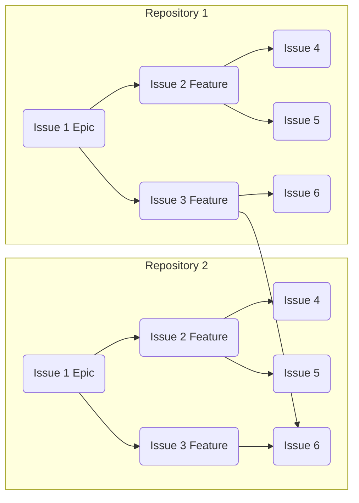

# Issue Herarchy

```mermaid

flowchart LR

subgraph Repository 2
    i21(Issue 1 Epic)
    i22(Issue 2 Feature)
    i23(Issue 3 Feature)
    i24(Issue 4)
    i25(Issue 5)
    i26(Issue 6)
end

subgraph Repository 1
    i11(Issue 1 Epic)
    i12(Issue 2 Feature)
    i13(Issue 3 Feature)
    i14(Issue 4)
    i15(Issue 5)
    i16(Issue 6)
end

i11-->i12 
i11-->i13
i12-->i14
i12-->i15
i13-->i16

i21-->i22 
i21-->i23
i22-->i24
i22-->i25
i23-->i26

i13--> i26


```