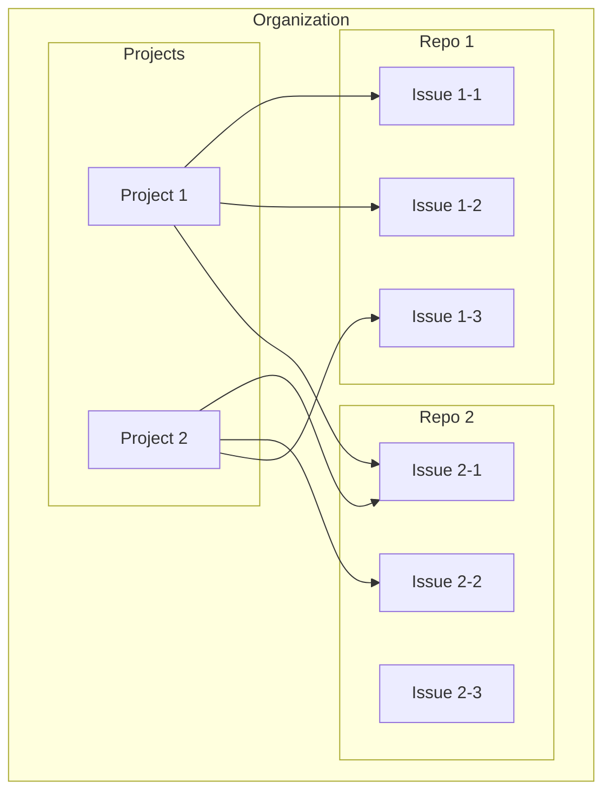

### Diagram Projects and Items

```mermaid
flowchart 

    subgraph Organization

        subgraph Projects
            p1[Project 1]
            p2[Project 2]
%%            P3[Project 3]
        end

        subgraph Repo 1

            i11[Issue 1-1]
            i12[Issue 1-2]
            i13[Issue 1-3]
%%            PR1[PR 1-1]
%%            PR2[PR 1-2]
%%            PR3[PR 1-3]
        end

        subgraph Repo 2

            i21[Issue 2-1]
            i22[Issue 2-2]
            i23[Issue 2-3]
%%            PR4[PR 2-1]
%%            PR5[PR 2-2]
%%            PR6[PR 2-3]
        end

 p1-->i11
 p1-->i12
 p1-->i21
p2--> i21
p2--> i22
p2 --> i13

    %%Org
    end 
```