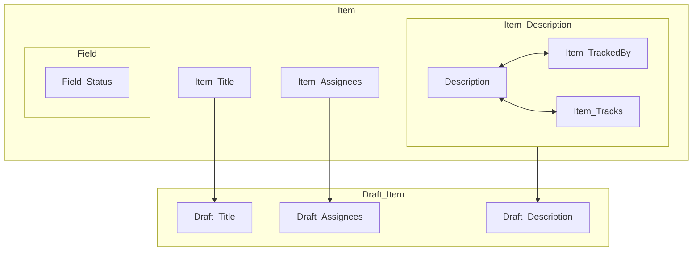
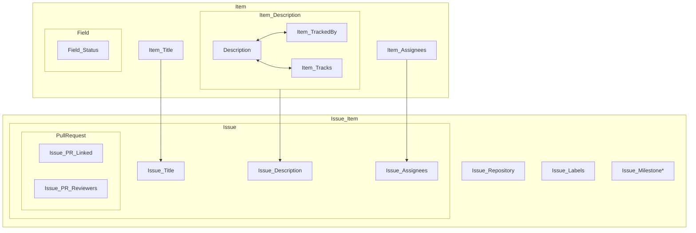

# Items Fields

## Draft Item

```mermaid
flowchart

subgraph Item
    Item_Title
    
    Item_Assignees

    subgraph Item_Description
        Description
        Item_TrackedBy
        Item_Tracks
        Description <--> Item_TrackedBy
        Description <--> Item_Tracks
    end

    subgraph Field
        direction LR
        Field_Status
    end

end

subgraph Draft_Item
direction LR
    Draft_Title
    Draft_Assignees
    Draft_Description

end

Item_Title --> Draft_Title 
Item_Description --> Draft_Description 
Item_Assignees --> Draft_Assignees 

```

---

## Issue Item

```mermaid
flowchart 

subgraph Issue_Item
    direction LR
    Issue_Title
    Issue_Description
    Issue_Repository
    Issue_Assignees
    Issue_Labels
    Issue_Milestone*
    subgraph Issue
        direction LR
        Issue_Title
        Issue_Description
        Issue_Assignees
        subgraph PullRequest
            direction LR
            Issue_PR_Linked
            Issue_PR_Reviewers
        end
    end

end

subgraph Item
    direction LR

    Item_Title
    Item_Assignees
    Item_TrackedBy
    Item_Tracks

    subgraph Item_Description
        Description
        Item_TrackedBy
        Item_Tracks
        Description <--> Item_TrackedBy
        Description <--> Item_Tracks
    end

    subgraph Field
        direction LR
        Field_Status
    end

end


Item_Title --> Issue_Title 
Item_Description --> Issue_Description 
Item_Assignees --> Issue_Assignees 


```
