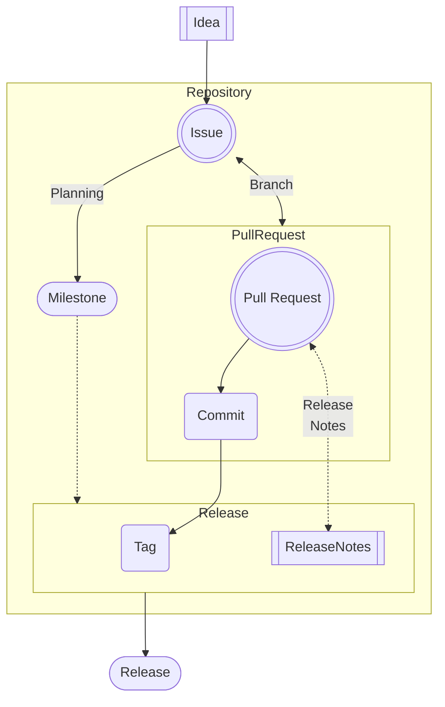

# Repository Issue relation

```mermaid
flowchart TD
    
ID[[Idea]]

    ID --> IS

subgraph Repository
    IS(((Issue)))
    ML([Milestone])

    subgraph PRg[PullRequest]
        PR(((Pull Request)))
        CM(Commit)
        PR --> CM
    end

    IS --Planning--> ML
    IS <--Branch--> PRg

    subgraph RLg[Release]
    TG(Tag)

    RN[[ReleaseNotes]]
    end

    PR <-. "`Release 
                    Notes`".-> RN


    CM --> TG
    ML -..-> RLg
end

    RL([Release])
    RLg-->RL

```